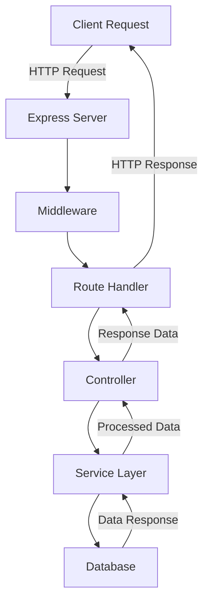

# Express Starter App

A modern starter project for quickly bootstrapping your Express.js backend journey with a clean structure, essential tools, and pre-installed packages to streamline development.

## Features

### 1. Modern Project Structure

The project follows a well-organized structure to separate concerns and make the codebase scalable:

```
express-starter-app/
├── bin/                 # Server bootstrapping scripts
├── node_modules/        # Installed npm packages
├── public/              # Static files (e.g., CSS, images, JS)
├── src/                 # Source code
│   ├── config/          # Configuration files (e.g., environment setup)
│   ├── controllers/     # Request handler logic
│   ├── middlewares/     # Custom middleware
│   ├── models/          # Database models (if applicable)
│   ├── routes/          # API routes
│   ├── schemas/         # Validation schemas (if applicable)
├── views/               # Template engine views
├── .env                 # Environment variables
├── app.js               # Entry point of the application
├── package.json         # Project dependencies and scripts
├── package-lock.json    # Locked dependency versions
└── README.md            # Project documentation
```

### 2. ES6 Module Support

The project is configured to use ES6 modules (`type: "module"` in `package.json`) for modern syntax like `import` and `export`.

### 3. Pre-installed Packages

#### Dependencies:

- **express**: Web framework for building APIs and web applications.
- **cookie-parser**: Parses cookies from HTTP requests.
- **morgan**: HTTP request logger for debugging.
- **http-errors**: Handles and creates HTTP errors.
- **jade**: Template engine for dynamic view rendering.

#### Dev Dependencies:

- **nodemon**: Automatically restarts the server on file changes in development mode.
- **prettier**: Formats and enforces consistent code style.
- **dotenv**: Loads environment variables from a `.env` file.
- **debug**: Debugging utility for logging in development.
- **eslint**: For linting and enforcing consistent coding style.
- **jest**: JavaScript testing framework for unit tests.
- **supertest**: HTTP assertions for testing Express endpoints.
- **cross-env**: Allows setting environment variables across platforms.

### 4. Development Workflow

The project is set up for a seamless development experience:

- **Hot Reloading**: Using `nodemon`, the server restarts automatically on code changes.
- **Code Formatting**: Use Prettier for consistent indentation and linting.
- **Environment Management**: Load sensitive data using `dotenv` from a `.env` file.
- **Linting**: Use ESLint to catch potential code issues and enforce standards.
- **Testing**: Write unit tests with Jest and test HTTP routes with Supertest.

## Getting Started

### Prerequisites

Ensure you have the following installed:

- [Node.js](https://nodejs.org/) (v14 or higher)
- [npm](https://www.npmjs.com/) or [yarn](https://yarnpkg.com/)

### Installation

1. Clone the repository:

   ```bash
   git clone <repository-url>
   cd express-starter-app
   ```

2. Install dependencies:

   ```bash
   npm install
   ```

3. Create a `.env` file in the root directory for environment variables:

   ```env
   PORT=3000
   DATABASE_URL=your-database-url
   ```

4. Start the development server:
   ```bash
   npm start
   ```

### Project Structure

- **bin/www**: Server entry point.
- **src/**: Contains all application logic (routes, middlewares, controllers, etc.).
- **views/**: Dynamic templates for rendering views (default engine: Jade).

## Scripts

- **`npm start`**: Starts the application in development mode using `nodemon`.

## Contributing

Feel free to open issues or submit pull requests if you find bugs or want to enhance the project.

## License

This project is licensed under the MIT License. See the `LICENSE` file for details.

---

## Data Flow

The following diagram illustrates the data flow within the Express Starter App to automate the process:



1. **Client Request**: The client sends an HTTP request to the Express server.
2. **Express Server**: The server receives the request and passes it through middleware.
3. **Middleware**: Custom middleware functions process the request (e.g., authentication, logging).
4. **Route Handler**: The request is routed to the appropriate handler based on the URL and HTTP method.
5. **Controller**: The controller contains the logic to handle the request and interacts with the service layer.
6. **Service Layer**: The service layer contains business logic and interacts with the database.
7. **Database**: The database performs CRUD operations and returns data to the service layer.
8. **Response**: The processed data is sent back through the controller, route handler, and middleware to the client as an HTTP response.

This flow ensures a clean separation of concerns and makes the application scalable and maintainable.

Happy coding with Express! 🚀
